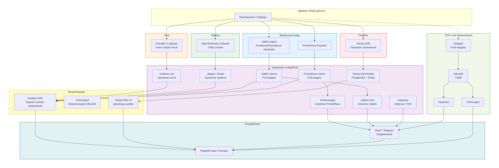

# Домашнее задание к занятию "13.Системы мониторинга"

## Обязательные задания

Вопрос № 1. 
Вас пригласили настроить мониторинг на проект. На онбординге вам рассказали, что проект представляет из себя 
платформу для вычислений с выдачей текстовых отчетов, которые сохраняются на диск. Взаимодействие с платформой 
осуществляется по протоколу http. Также вам отметили, что вычисления загружают ЦПУ. Какой минимальный набор метрик вы
выведите в мониторинг и почему?
#
Ответ:
  Минимальный набор строится на 4 золотых сигналах: Latency (HTTP, генерация отчета), Traffic (RPS, запись на диск), Errors (коды ответов, ошибки сохранения), Saturation (CPU, память, диск, inode). На Python напишемподсчет количества созданных отчетов и время их создания, по данномупоказателю, можно будет вывести аналитику о загруженности.перегруженности или недоступности системы.

  Показатель задержка и затем доступность - самые основные, чтобы проанализировать задержки на vSAN или Fiber ChannelSAN или NAS. Указать на проблеммы провайдеру ЦОД, спросить не проводятсяли какие-либо работы у провайдера. 

  Далее графики и колличество 500, за сегодня вчера и на протяжении 2х недель месяца, дадут исчерпывающую информацию, что что-то начало происходить, или заболее короткий срок, что что-то случилось с системой, может админы решили пересобрать кластер или на minio s3 закончилось свободное место - получается более наглядный, долгий для мониторинга процесс, где требуется набрать статистическую информацию по использованию ресурсов для анализа графиков по росту загруженности. Так же неплохо посчитать IOPS каждого из модулей системы, сервиса, ответов по сети, прохождение больших пакетов и latency, использование памяти и количество обращений к дискам, рост очередей обращений или их блокировка по максимальному значению. Анализ QoS в IP телефонии. Будь то трафик nginx или ответы приложения, включая внутренние ошибки в логах системы. А также параллельных систем использующих то же оборудование и могущий создать нагрузку.

  Про CPU, посмотреть надо утилизацию сетевого трафика и дисков. Не редко сеть при неправильной настройкедрайверов или выборе сетевых карт, использует CPU, тем самым нагружая систему.

  Так же, мы должны учитывать необходимость задавать "окно" для полной антивирусной проверки или выполнения бекап, и снапшоты если  они делаются на уровне операционной системы, а не на уровне СХД. Чтобы избежать кратковременных, но последовательных  отказов сервиса, в технологическое окно. 


Вопрос № 2.
Менеджер продукта посмотрев на ваши метрики сказал, что ему непонятно что такое RAM/inodes/CPUla. Также он сказал, 
что хочет понимать, насколько мы выполняем свои обязанности перед клиентами и какое качество обслуживания. Что вы 
можете ему предложить?
#
Ответ:
  Рекомендую менеджеру, рассмотреть показатели SLI и SLO. 
  SLI покажет как работает приложение со стороны пользователя или сотрудников, 
  SLO дает нам понимание для проведения разработки, допилить фичи, провести тесты, а далее выкатить их в релиз, обязательно мониторя  сервис после выкатки на колличество "падений" со стороны пользователя. 

  Используем такие показатели, как: 
    - процент успешных HTTP-запросов (без 5xx ошибок).
    - процент успешно созданных и сохраненных отчетов. 

    Гипотетически данная "бизнес-метрика" говорит, о выполнении SLA.

    - количество созданных отчетов за период. Показывает объем выполненной работы.

  Далее для каждого показателя мы вместе с менеджером установим цели (SLO). К примеру: 95% отчетов генерирующихся быстрее 3 секунд и доступностью 99.9%. 
    На их основе сделаем дашборд со "светофором": зеленый — цели выполняются, красный — есть проблема, синий - допустимое состояние загрузки (учитываются сбор метрик в технологическое окно).


Вопрос № 3. 
Вашей DevOps команде в этом году не выделили финансирование на построение системы сбора логов. Разработчики в свою 
очередь хотят видеть все ошибки, которые выдают их приложения. Какое решение вы можете предпринять в этой ситуации, 
чтобы разработчики получали ошибки приложения?
#

Ответ:
  Ситуация классическая, денег на стек сбора логов типа Elastic Stack, Graylog, Loki - не дали, будем выкручиваться своими силами.

  Рассмотрим другие продукты:
  
  1) Grafana OSS (Open Source) — базовая, бесплатная редакция с открытым исходным кодом.

  2) Prometheus - система для мониторинга и алертинга с открытым исходным кодом.
  
  3) InfluxDB (не Enterprise) — база данных временных рядов с открытым исходным кодом.
  
  4) Zabbix - система мониторинга корпоративного уровня с открытым исходным кодом.
  
  5) Sentry - предполагает бесплатную пробную версию и платные планы. 
    Подход Sentry Fair Source был разработан как компромисс между открытым исходным кодом и коммерческой лицензией. Он позволяет использовать программное обеспечение бесплатно, если мы не применяем его в конкурирующем продукте, а пользуетесь Sentry только для внутренних целей разработки, некоммерческих образовательных проектов и исследований. В остальных случаях потребуется приобрести коммерческую лицензию. 
      Одной из ключевых особенностей fair source является условие отложенной публикации исходного кода, называемое Delayed Open Source Publication (DOSP). То есть по прошествии определённого времени код становится полностью открытым. Например, для функциональной лицензии Sentry (Functional Source License, FSL) этот период составляет 2 года, а для бизнес-лицензии Business Source License (BUSL) — 4 года.
  Подробнее: https://www.securitylab.ru/news/552316.php

Таблица "Программные продукты"(информация актуальна на 22.03.2026 и может быть изменена в будущем =).


| --------------------------------- | ---------------------------------- | ------------------------------ |
| Домен ответственности             | Инструмент                         | Лицензия                       |
|-----------------------------------|------------------------------------|--------------------------------|
| --------------------------------- | ---------------------------------- | ------------------------------ |
| Система «Перехватчик ошибок»      | Sentry (self-hosted, Fair Source)  | Бесплатно для внутреннего исп. |
| --------------------------------- | ---------------------------------- | ------------------------------ |
| Система сбора временных рядов     | Prometheus + Zabbix                | Open Source (Apache 2.0 / GPL) |
| --------------------------------- | ---------------------------------- | ------------------------------ |
| Система сбора логов               | Grafana OSS + Loki                 | Open Source (AGPLv3)           |
| --------------------------------- | ---------------------------------- | ------------------------------ |
| Система сбора трейсов             | Jaeger / OpenTelemetry             | Open Source (Apache 2.0)       |
| --------------------------------- | ---------------------------------- | ------------------------------ |


Продукты определены, теперь посмотрим что получается для построения полноценного архитектурного решения, отметим тот факт, что система может быть изменена при изменении законодательства. Для перестроения системы потребуется рассмотреть финансирование сотрудников инженерного состава и финансирование ИТ комплекса системы мониторинга.

Архитектура решения:  


Алгоритм работы:
Как всё связано в работе
Приложение падает → Sentry ловит ошибку → разработчик получает уведомление в Slack → открывает Sentry, видит стек-трейс и контекст.

Нужно понять, почему упало → разработчик идёт в Grafana → смотрит логи (Loki) по времени ошибки → смотрит трейсы (Tempo), чтобы увидеть полный путь запроса.

Начинает тормозить база данных → Prometheus замечает рост времени ответа → Alertmanager отправляет предупреждение DevOps → DevOps открывает Grafana, смотрит метрики CPU, IOPS, количество соединений → принимает меры (скейлинг, оптимизация запросов).

Закончилось место на диске → Zabbix триггер срабатывает → уведомление в Slack → DevOps проверяет, чистит логи или расширяет диск.

Разработчики видят такую схемку:


Вопрос № 4. Вы, как опытный SRE, сделали мониторинг, куда вывели отображения выполнения SLA=99% по http кодам ответов. 
Вычисляете этот параметр по следующей формуле: summ_2xx_requests/summ_all_requests. Данный параметр не поднимается выше 
70%, но при этом в вашей системе нет кодов ответа 5xx и 4xx. Где у вас ошибка?
#

Ответ:
Ошибка в том, что формула summ_2xx_requests / summ_all_requests учитывает не все успешные ответы, а только 2xx.

В HTTP-спецификации успешными считаются не только 2xx, но и 3xx (редиректы).
В нашей системе:

Нет 4xx (ошибки клиента)
Нет 5xx (ошибки сервера)

Составим формулу:

SLI = (summ_2xx_requests + summ_3xx_requests) / (summ_all_requests)

В результате мы получили 100% информации.

Вопрос № 5. Опишите основные плюсы и минусы pull и push систем мониторинга.
#

Ответ:
Начнем с инфры, push отправляет инфу и может за-ddos'ить систему, в то время как pull наоборот при недоступности сервиса может молчать.

Push:  Агент отправляет данные
Cервис инициирует соединение и отправляет метрики на сервер или агент сервера.
Плюсы  push:
- Простота масштабирования и безопасности сети. Агентам не нужно открывать входящие порты на серверах. Сборщик может быть на вненем IP, что важно при работе с географически распределенной инфраструктурой или спрятан за NAT.

- Если на внутренней сети есть разрешающие правила (10500, 10501 для активных агентов), а так же Push-протоколы часто работают поверх TCP/HTTP с возможностью получения подтверждения (`200 OK`), то если агент не получил подтверждение, он может положить данные в буфер на диске и отправить позже. Это снижает риск потери метрик при перезагрузке агента.

- Низкая задержка оповещений. Агент может отслеживать состояние на месте и моментально отправить критический алерт, не дожидаясь, пока сервер «вспомнит» его опросить. При этом как говорил в начале при сетевой недоступности, может появиться окно недоступности.

- Сервер мониторинга может потребовать выделить себе большие вычислительные мощности, CPU RAM HDD, потому что сам будет перегружен в результате опрашивания серверов, в том числе он будет гененрировать много сетевого трафика. Агент же отправляет данные по расписанию.

**Минусы:**
- ddos на инфраструктуру, если 10 000 агентов одновременно решат отправить данные, после потери связи или при рестарте, это создаст нагрузку на базу данных и сеть.
- не понятно сколько данных отправляет агент. Сломавшийся агент на сервере может генерировать очень много метрик, создавая нагрузку на инфраструктуру мониторинга.
- чтобы начать мониторить новый сервер, нужно заранее завести его в систему мониторинга "руками", или использовать Discovery.
- push-системе перегруженный агент начинает терять данные или отказывать агентам.


Pull-модель (Сервер мониторинга опрашивает)
При этой схеме сервер мониторинга инициирует соединение к экспортерам или API целевых систем.
Плюсы:
- Преимуществом является факт, что если сервис упал или сеть недоступна, сервер получает timeout и возникет аллерт Down или Disconnected или Unavaliable и тому подобное. В итоге, в push-системе, если агент не отвечает вместе с сервером, то пожно явно сказать что проблемма с сетевой связанностью или с серваком.
- Централизованный контроль опроса. Если сервер перегружен, то он может замедлить опрос (скрейпинг), не теряя данные сдвигая временные метки.
- Простота авторизации и безопасности. Достаточно настроить TLS-сертификаты и базовую аутентификацию на стороне экспортеров или агентов того же забикса. Что позволит быстро получить информацию о системе и lasted data.
- Автоматическое обнаружение. Такие системы идеально интегрируются с облачными средами и оркестраторами (K8s). Сервер видит список подов через API K8s и автоматически начинает их опрашивать без необходимости переконфигурировать агентов.

Минусы:
- Сложность работы с NAT и динамическими портами. Если сервер находится в защищенном периметре, а рабочие станции или удаленные дата-центры — за NAT, Pull-сервер физически не может достучаться до них. Это требует развертывания прокси (Pushgateway в Prometheus) или туннелей, что фактически превращает систему в гибрид.
- Нагрузка на экспортеры. Если один сервер мониторинга опрашивает 5000 целей каждые 15 секунд, это создает постоянный поток TCP-соединений. А так же, частый опрос, может приводить к повышенной нагрузке на CPU и сериализации.
- Ограниченная кастомизация интервалов опросов.  Как правило интервал опроса одинаков для группы объектов мониторинга. Если нужно для одного критичного сервиса собирать метрики раз в секунду, а для остальных раз в минуту, то конфигурация становится громоздкой, и нагрузка на сервер возрастает не линейно.


Вопрос № 6. Какие из ниже перечисленных систем относятся к push модели, а какие к pull? А может есть гибридные?

    - Prometheus 
    - TICK
    - Zabbix
    - VictoriaMetrics
    - Nagios
#

Ответ:
    - Prometheus 
эталонный представителем pull-модели (но есть гибридный компонент — Pushgateway),
с помощью batch-джоб и cron-скриптов
    - TICK
TICK (Telegraf, InfluxDB, Chronograf, Kapacitor) относится к push-модели. Агент Telegraf собирает метрики и отправляет в базу данных InfluxDB.

    - Zabbix
Он может и через агент забирать данные с серверов мониторинга, а так же если идет опрос сетевого оборудования, ИБП или СХД то может опрашивать по SNMP. Через http агенты не настраивал, но вроде тоже можно.  Получается Гибридный вариант работы.

    - VictoriaMetrics
Гибридная система, проектировалась как высокопроизводительное хранилище, способное работать в обоих режимах.

    - Nagios
Сервер активно опрашивает агенты (NRPE), и это считаю pull, так как сервер ходит на хосты и забирает данные с них.


Вопрос № 7. Склонируйте себе [репозиторий](https://github.com/influxdata/sandbox/tree/master) и запустите TICK-стэк, 
используя технологии docker и docker-compose.

В виде решения на это упражнение приведите скриншот веб-интерфейса ПО chronograf (`http://localhost:8888`). 

P.S.: если при запуске некоторые контейнеры будут падать с ошибкой - проставьте им режим `Z`, например
`./data:/var/lib:Z`
#
Вопрос № 8. Перейдите в веб-интерфейс Chronograf (http://localhost:8888) и откройте вкладку Data explorer.
        
    - Нажмите на кнопку Add a query
    - Изучите вывод интерфейса и выберите БД telegraf.autogen
    - В `measurments` выберите cpu->host->telegraf-getting-started, а в `fields` выберите usage_system. Внизу появится график утилизации cpu.
    - Вверху вы можете увидеть запрос, аналогичный SQL-синтаксису. Поэкспериментируйте с запросом, попробуйте изменить группировку и интервал наблюдений.

Для выполнения задания приведите скриншот с отображением метрик утилизации cpu из веб-интерфейса.
#
Вопрос № 9. Изучите список [telegraf inputs](https://github.com/influxdata/telegraf/tree/master/plugins/inputs). 
Добавьте в конфигурацию telegraf следующий плагин - [docker](https://github.com/influxdata/telegraf/tree/master/plugins/inputs/docker):
```
[[inputs.docker]]
  endpoint = "unix:///var/run/docker.sock"
```

Дополнительно вам может потребоваться донастройка контейнера telegraf в `docker-compose.yml` дополнительного volume и 
режима privileged:
```
  telegraf:
    image: telegraf:1.4.0
    privileged: true
    volumes:
      - ./etc/telegraf.conf:/etc/telegraf/telegraf.conf:Z
      - /var/run/docker.sock:/var/run/docker.sock:Z
    links:
      - influxdb
    ports:
      - "8092:8092/udp"
      - "8094:8094"
      - "8125:8125/udp"
```

После настройке перезапустите telegraf, обновите веб интерфейс и приведите скриншотом список `measurments` в 
веб-интерфейсе базы telegraf.autogen . Там должны появиться метрики, связанные с docker.

Факультативно можете изучить какие метрики собирает telegraf после выполнения данного задания.

## Дополнительное задание (со звездочкой*) - необязательно к выполнению

Вопрос № 1*. 
Вы устроились на работу в стартап. На данный момент у вас нет возможности развернуть полноценную систему 
мониторинга, и вы решили самостоятельно написать простой python3-скрипт для сбора основных метрик сервера. Вы, как 
опытный системный-администратор, знаете, что системная информация сервера лежит в директории `/proc`. 
Также, вы знаете, что в системе Linux есть  планировщик задач cron, который может запускать задачи по расписанию.

Суммировав все, вы спроектировали приложение, которое:
- является python3 скриптом
- собирает метрики из папки `/proc`
- складывает метрики в файл 'YY-MM-DD-awesome-monitoring.log' в директорию /var/log 
(YY - год, MM - месяц, DD - день)
- каждый сбор метрик складывается в виде json-строки, в виде:
  + timestamp (временная метка, int, unixtimestamp)
  + metric_1 (метрика 1)
  + metric_2 (метрика 2)
  
     ...
     
  + metric_N (метрика N)
  
- сбор метрик происходит каждую 1 минуту по cron-расписанию

Для успешного выполнения задания нужно привести:

а) работающий код python3-скрипта,

б) конфигурацию cron-расписания,

в) пример верно сформированного 'YY-MM-DD-awesome-monitoring.log', имеющий не менее 5 записей,

P.S.: количество собираемых метрик должно быть не менее 4-х.
P.P.S.: по желанию можно себя не ограничивать только сбором метрик из `/proc`.

Вопрос № 2*. 
В веб-интерфейсе откройте вкладку `Dashboards`. Попробуйте создать свой dashboard с отображением:

    - утилизации ЦПУ
    - количества использованного RAM
    - утилизации пространства на дисках
    - количество поднятых контейнеров
    - аптайм
    - ...
    - фантазируйте)
    
    ---

### Как оформить ДЗ?

Выполненное домашнее задание пришлите ссылкой на .md-файл в вашем репозитории.

---
